# Exploratory Data Analysis in anumaan

``` r
library(anumaan)
library(dplyr)
```

## Overview

This vignette covers the **exploratory data analysis (EDA) layer**. It
sits between the two other pipelines: it is run on data that has already
been through
[Preprocessing](https://saketlab.github.io/anumaan/articles/preprocessing-workflow.md),
and it is what a stewardship team typically reviews *before* committing
to [DALY burden
estimation](https://saketlab.github.io/anumaan/articles/daly-pipeline.md).
It does not transform data (like Pipeline 1) or estimate burden (like
Pipeline 3) – it only visualises what is already there, to catch
data-quality problems and characterise the cohort before further
modelling.

All functions in this layer are named `plot_*` (with the shared styling
helper
[`eda_theme()`](https://saketlab.github.io/anumaan/reference/eda_theme.md)),
which is deliberately distinct from the `prep_*` (Pipeline 1) and
`daly_*` (Pipeline 3) naming used elsewhere in the package.

Most `plot_*` functions here share a common `mode` argument:

- **`"faceted"`** – one panel per centre (the default for most
  functions)
- **`"overall"`** – all centres pooled into a single chart
- **`"single"`** – one specific centre, passed via `center = "..."`

and a common `syndrome_col`/`syndrome_name` pair for restricting the
plot to one infectious syndrome (e.g. `syndrome_name = "BSI"`) when that
column is available.

### Connecting from Pipeline 1

The `plot_*` functions’ *default* column names (`organism_name`,
`antibiotic_value`, `PatientInformation_id`, …) are convenience defaults
for raw-ish data – they do **not** automatically match the standardised
column names
[Preprocessing](https://saketlab.github.io/anumaan/articles/preprocessing-workflow.md)
actually produces. When passing real preprocessed output into these
functions, map the arguments to Pipeline 1’s real output columns
explicitly:

| EDA argument     | Pipeline 1’s actual output column                                                                                                                                                                                                                            |
|------------------|--------------------------------------------------------------------------------------------------------------------------------------------------------------------------------------------------------------------------------------------------------------|
| `patient_col`    | `patient_id`                                                                                                                                                                                                                                                 |
| `organism_col`   | `organism_normalized` (from [`prep_standardize_organisms()`](https://saketlab.github.io/anumaan/reference/prep_standardize_organisms.md))                                                                                                                    |
| `antibiotic_col` | `antibiotic_normalized` (from [`prep_standardize_antibiotics()`](https://saketlab.github.io/anumaan/reference/prep_standardize_antibiotics.md))                                                                                                              |
| `value_col`      | `ast_value_harmonized` (from [`prep_harmonize_ast()`](https://saketlab.github.io/anumaan/reference/prep_harmonize_ast.md))                                                                                                                                   |
| `sample_col`     | `specimen_normalized` (from [`prep_standardize_specimens()`](https://saketlab.github.io/anumaan/reference/prep_standardize_specimens.md))                                                                                                                    |
| `agebin_col`     | `Age_bin` (from [`prep_assign_age_bins()`](https://saketlab.github.io/anumaan/reference/prep_assign_age_bins.md))                                                                                                                                            |
| `age_col`        | `Age` (from [`prep_fill_age()`](https://saketlab.github.io/anumaan/reference/prep_fill_age.md))                                                                                                                                                              |
| `admission_col`  | `date_of_admission`                                                                                                                                                                                                                                          |
| `culture_col`    | `date_of_culture`                                                                                                                                                                                                                                            |
| `discharge_col`  | `date_of_final_outcome`                                                                                                                                                                                                                                      |
| `center_col`     | `center_name` (a user-supplied raw column – Pipeline 1 does not invent hospital identity, it just carries it through)                                                                                                                                        |
| `outcome_col`    | `final_outcome` (the raw outcome text persists unchanged; [`prep_standardize_final_outcome()`](https://saketlab.github.io/anumaan/reference/prep_standardize_final_outcome.md) *adds* a separate `outcome_std` column alongside it rather than replacing it) |

Every example below uses these Pipeline-1-aligned names, with the
arguments passed explicitly rather than relying on defaults.

## A Small Synthetic Dataset

The examples below use a small synthetic long-format dataset (one row
per isolate x antibiotic) with the same column names Pipeline 1 would
hand off – as if it were the output of the
[Preprocessing](https://saketlab.github.io/anumaan/articles/preprocessing-workflow.md)
vignette’s `prepped` object, scaled up to two hospitals so the
`mode = "faceted"` examples have something to facet over.

``` r
set.seed(42)
n_pts <- 60
centers <- c("General Hospital", "City Medical Center")
organisms <- c("Escherichia coli", "Klebsiella pneumoniae",
                "Staphylococcus aureus", "Pseudomonas aeruginosa")
antibiotics <- c("Amikacin", "Ciprofloxacin", "Meropenem", "Ceftriaxone")

eda_data <- data.frame(
  patient_id             = paste0("pt_", sprintf("%03d", rep(1:n_pts, each = 3))),
  center_name            = rep(sample(centers, n_pts, replace = TRUE), each = 3),
  organism_normalized    = rep(sample(organisms, n_pts, replace = TRUE), each = 3),
  antibiotic_normalized  = rep(antibiotics, length.out = n_pts * 3),
  ast_value_harmonized   = sample(c("R", "S"), n_pts * 3, replace = TRUE, prob = c(0.4, 0.6)),
  specimen_normalized    = rep(sample(c("Blood", "Urine", "Sputum"), n_pts, replace = TRUE), each = 3),
  final_outcome          = rep(sample(c("Death", "Discharged", "LAMA", "Transferred to other hospital"),
                                       n_pts, replace = TRUE, prob = c(0.15, 0.65, 0.1, 0.1)), each = 3),
  date_of_final_outcome  = rep(as.Date("2024-01-01") + sample(1:300, n_pts, replace = TRUE), each = 3),
  is_polymicrobial       = rep(sample(c(0, 1), n_pts, replace = TRUE, prob = c(0.75, 0.25)), each = 3),
  date_of_admission      = rep(as.Date("2024-01-01") + sample(1:300, n_pts, replace = TRUE), each = 3),
  location               = rep(sample(c("ICU", "Ward"), n_pts, replace = TRUE), each = 3),
  infection_type         = rep(sample(c("HAI", "CAI"), n_pts, replace = TRUE), each = 3),
  Age_bin                = rep(sample(c("<1", "1-5", "18-45", "45-65", "65+"), n_pts, replace = TRUE), each = 3),
  Age                    = rep(sample(0:85, n_pts, replace = TRUE), each = 3),
  infectious_syndrome    = rep(sample(c("BSI", "UTI", "RTI"), n_pts, replace = TRUE), each = 3),
  stringsAsFactors = FALSE
)
eda_data$date_of_culture <- eda_data$date_of_admission + sample(0:5, nrow(eda_data), replace = TRUE)

nrow(eda_data)
#> [1] 180
```

## Theme

[`eda_theme()`](https://saketlab.github.io/anumaan/reference/eda_theme.md)
is the shared visual style behind every plot in this vignette – based on
[`ggpubr::theme_pubr()`](https://rpkgs.datanovia.com/ggpubr/reference/theme_pubr.html)
when `ggpubr` is installed, falling back to
[`ggplot2::theme_bw()`](https://ggplot2.tidyverse.org/reference/ggtheme.html)
otherwise. You do not normally call it directly; it is applied
internally by every `plot_*` function.

``` r
eda_theme(base_size = 14)
```

## Organism and Susceptibility Overview

### Top organisms

``` r
plot_top_organisms(
  eda_data, n = 3, mode = "faceted",
  patient_col = "patient_id", organism_col = "organism_normalized", center_col = "center_name"
)
```

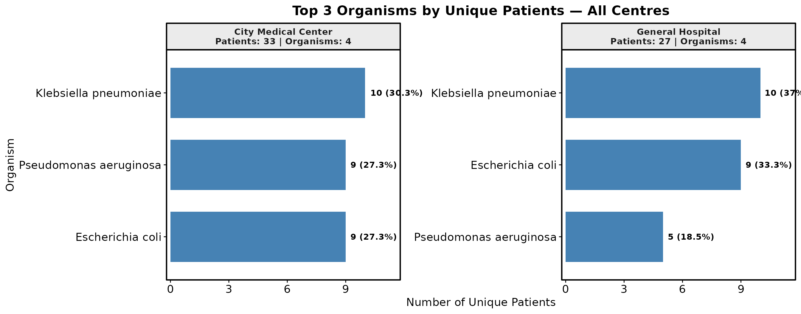

Pool across all centres with `mode = "overall"`, or restrict to one
centre with `mode = "single", center = "General Hospital"`.

### Susceptibility pattern (stacked R/S bars)

[`plot_abx_susceptibility()`](https://saketlab.github.io/anumaan/reference/plot_abx_susceptibility.md)
applies a **worst-phenotype rule**: if a patient has multiple records
for the same organism-antibiotic combination, a single R result marks
the whole episode as R, so repeat cultures from one infection episode
are not double-counted.

``` r
plot_abx_susceptibility(
  eda_data, n = 3, mode = "overall",
  patient_col = "patient_id", antibiotic_col = "antibiotic_normalized",
  value_col = "ast_value_harmonized", organism_col = "organism_normalized",
  center_col = "center_name"
)
```

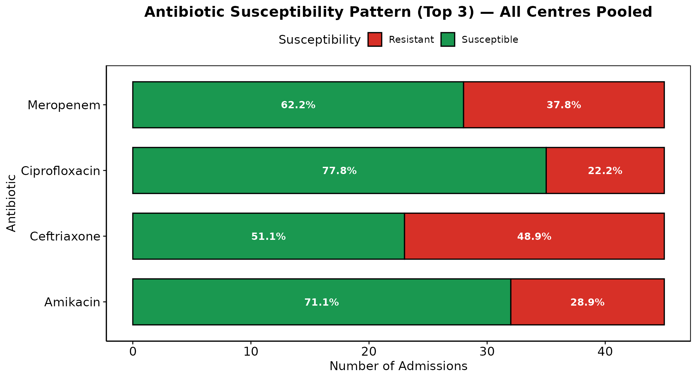

### Resistance heatmap

``` r
plot_abx_heatmap(
  eda_data, mode = "all",
  patient_col = "patient_id", antibiotic_col = "antibiotic_normalized",
  value_col = "ast_value_harmonized", organism_col = "organism_normalized",
  center_col = "center_name"
)
```

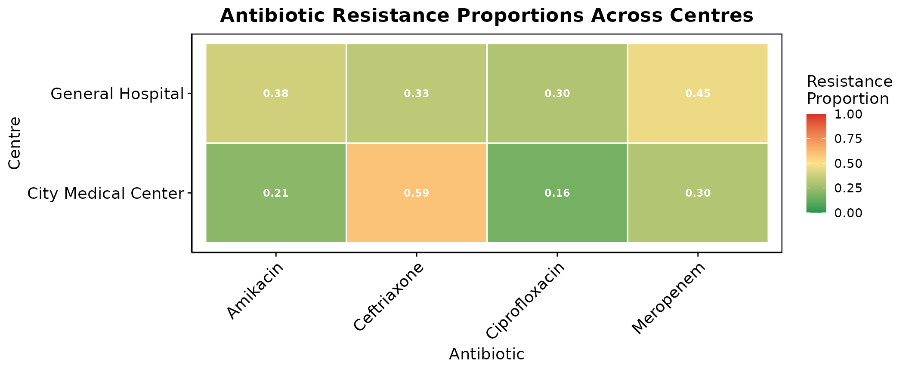

### Resistance by specimen type

``` r
plot_resistance_by_sample(
  eda_data, n = 3, mode = "overall",
  patient_col = "patient_id", sample_col = "specimen_normalized",
  organism_col = "organism_normalized", antibiotic_col = "antibiotic_normalized",
  value_col = "ast_value_harmonized", center_col = "center_name"
)
```

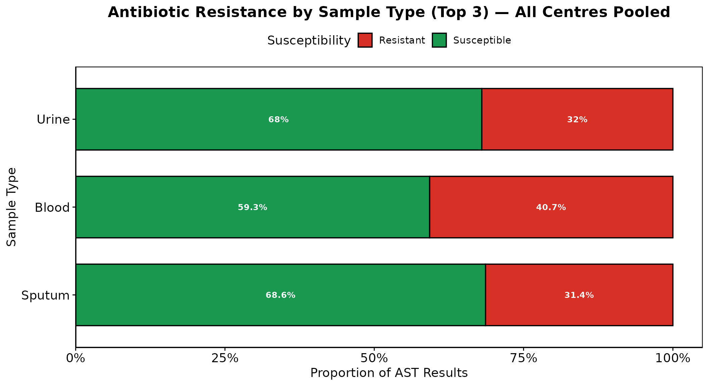

### Resistance by age bin and by organism

``` r
plot_resistance_by_agebin(
  eda_data, mode = "overall",
  patient_col = "patient_id", organism_col = "organism_normalized",
  antibiotic_col = "antibiotic_normalized", value_col = "ast_value_harmonized",
  agebin_col = "Age_bin", center_col = "center_name"
)
```

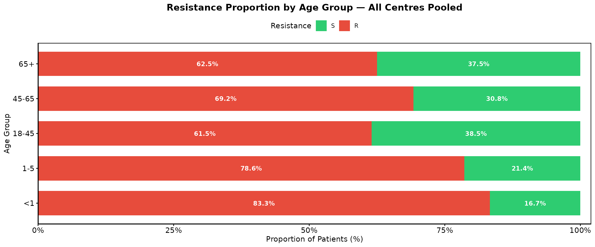

``` r
plot_resistance_by_organism(
  eda_data, n = 3, mode = "overall",
  patient_col = "patient_id", organism_col = "organism_normalized",
  antibiotic_col = "antibiotic_normalized", value_col = "ast_value_harmonized",
  center_col = "center_name"
)
```

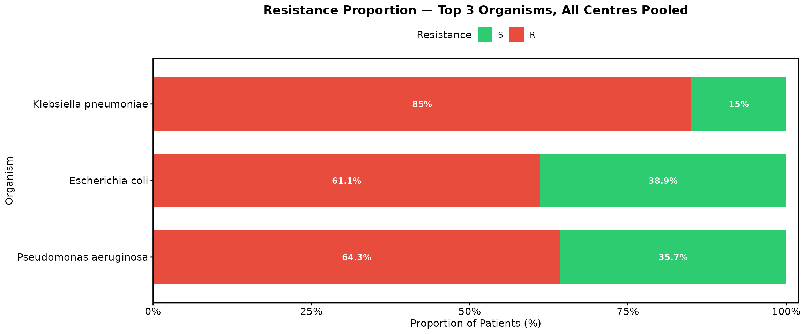

## Outcomes

### Overall distribution

By default `merge_referred = TRUE` recodes
`"Transferred to other hospital"` to `"Referred"`, since both represent
the same clinical event across centres.

``` r
plot_outcome_distribution(
  eda_data, mode = "overall",
  patient_col = "patient_id", outcome_col = "final_outcome", center_col = "center_name"
)
```

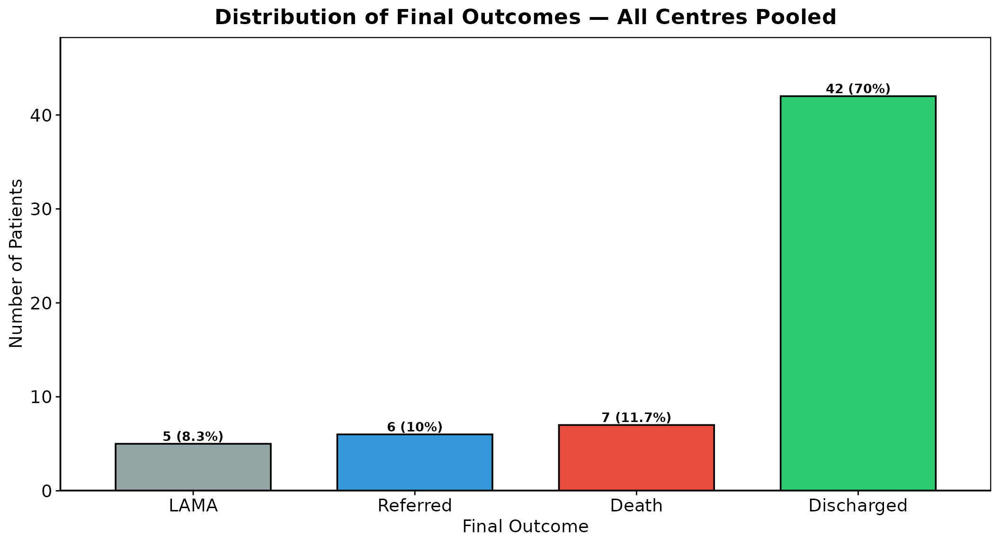

### Outcome by organism, split by resistance status

`resistance_filter = "R"` shows patients with *at least one* R result
for that organism; `"S"` shows patients with only S results. Because
these groups overlap, calling the function once for each gives the
fuller picture.

``` r
plot_outcome_by_organism(
  eda_data, n = 3, resistance_filter = "R", mode = "overall",
  patient_col = "patient_id", organism_col = "organism_normalized",
  antibiotic_col = "antibiotic_normalized", value_col = "ast_value_harmonized",
  outcome_col = "final_outcome", center_col = "center_name"
)
```

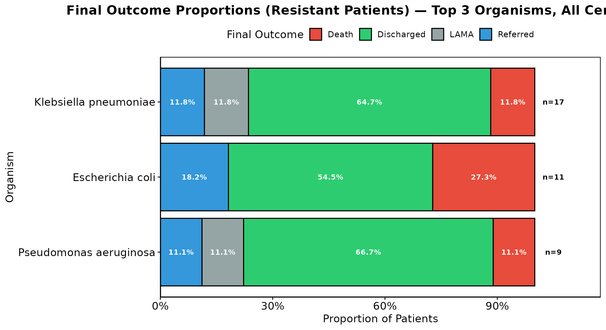

### Death vs. discharged

``` r
plot_death_discharged(
  eda_data, n = 3, mode = "overall",
  patient_col = "patient_id", organism_col = "organism_normalized",
  outcome_col = "final_outcome", center_col = "center_name",
  antibiotic_col = "antibiotic_normalized", value_col = "ast_value_harmonized"
)
```

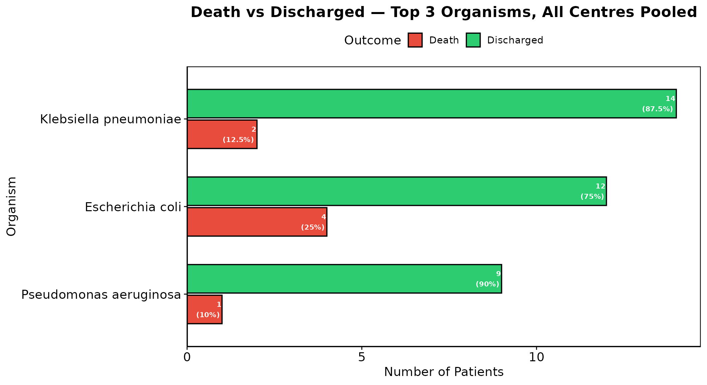

### Outcome by age bin and by year

``` r
plot_outcome_by_agebin(
  eda_data, mode = "overall",
  patient_col = "patient_id", agebin_col = "Age_bin",
  outcome_col = "final_outcome", center_col = "center_name"
)
```

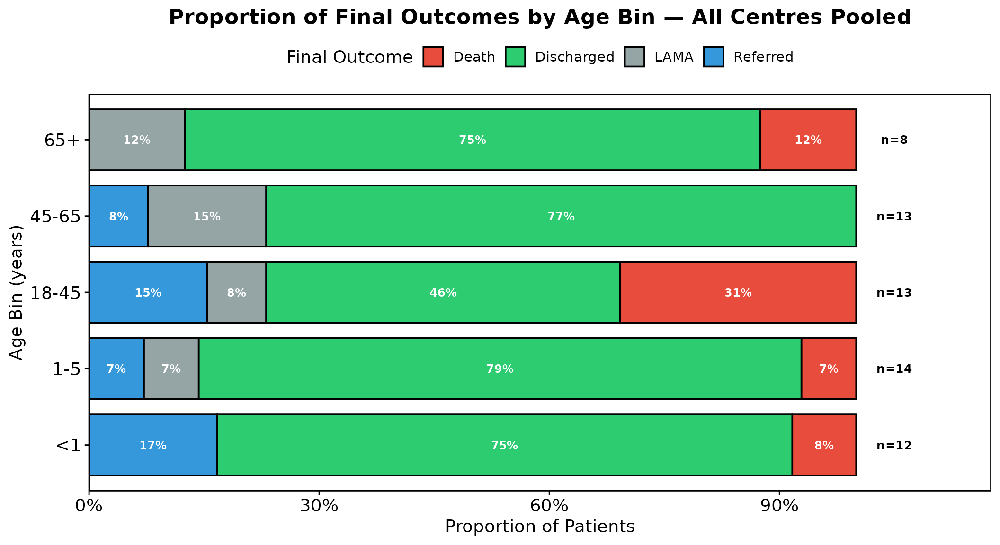

``` r
plot_outcome_by_year(
  eda_data, mode = "overall",
  patient_col = "patient_id", outcome_col = "final_outcome",
  date_col = "date_of_final_outcome", center_col = "center_name"
)
```

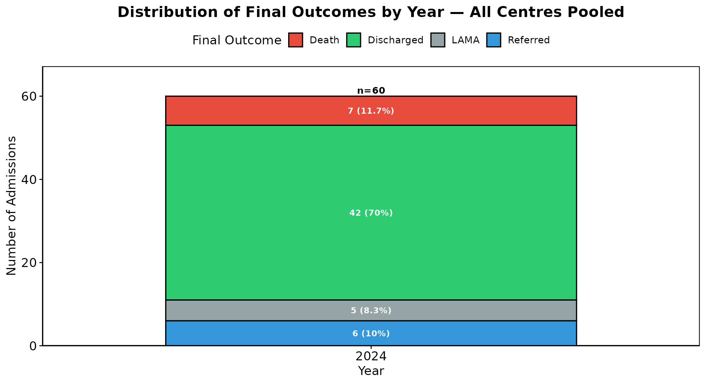

## Case-Mix and Facility Patterns

### Patients per hospital

``` r
plot_patients_by_hospital(eda_data, patient_col = "patient_id", center_col = "center_name")
```

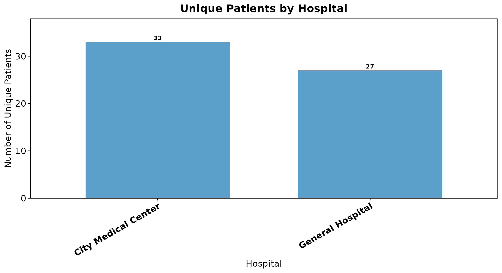

### Monomicrobial vs. polymicrobial, by facility

``` r
plot_mono_poly_by_facility(
  eda_data, patient_col = "patient_id", poly_col = "is_polymicrobial", center_col = "center_name"
)
```

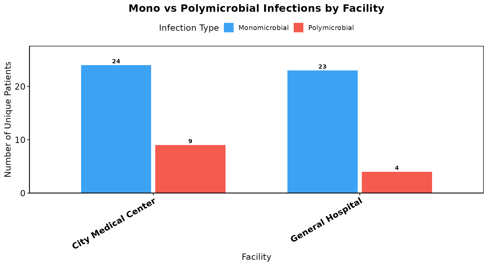

### HAI vs. CAI, by facility

Computed from the gap between `admission_col` and `culture_col`, using
`hai_threshold_hours` (default 48h) when an explicit infection-type
column is not already available.

``` r
plot_hai_cai_by_facility(
  eda_data, patient_col = "patient_id", center_col = "center_name",
  admission_col = "date_of_admission", culture_col = "date_of_culture"
)
```

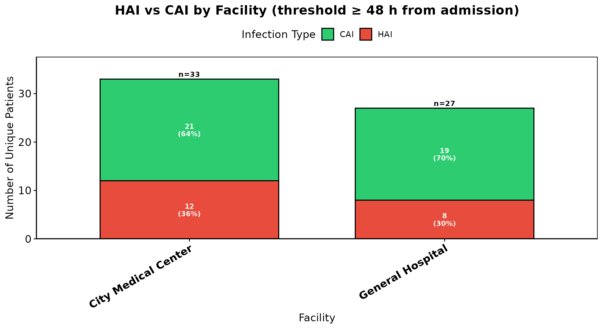

### Location (ICU vs. Ward), by facility

``` r
plot_location_by_facility(
  eda_data, patient_col = "patient_id", location_col = "location", center_col = "center_name"
)
```

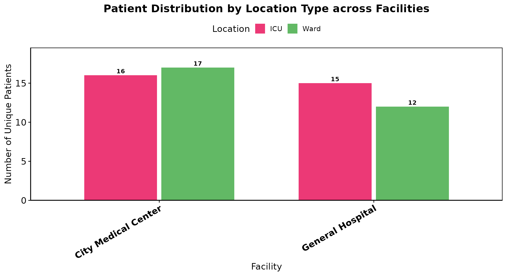

### Infection type by location

``` r
plot_infection_type_by_location(
  eda_data, style = "bar", patient_col = "patient_id", center_col = "center_name",
  location_col = "location", infection_col = "infection_type"
)
```

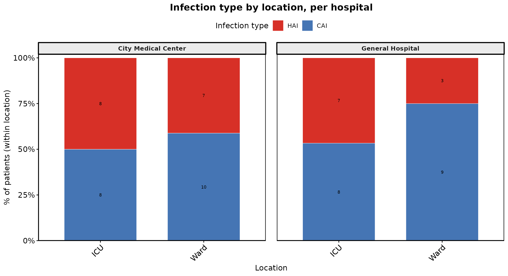

### Syndrome distribution

``` r
plot_syndrome_distribution(
  eda_data, mode = "overall", patient_col = "patient_id",
  syndrome_col = "infectious_syndrome", center_col = "center_name"
)
```

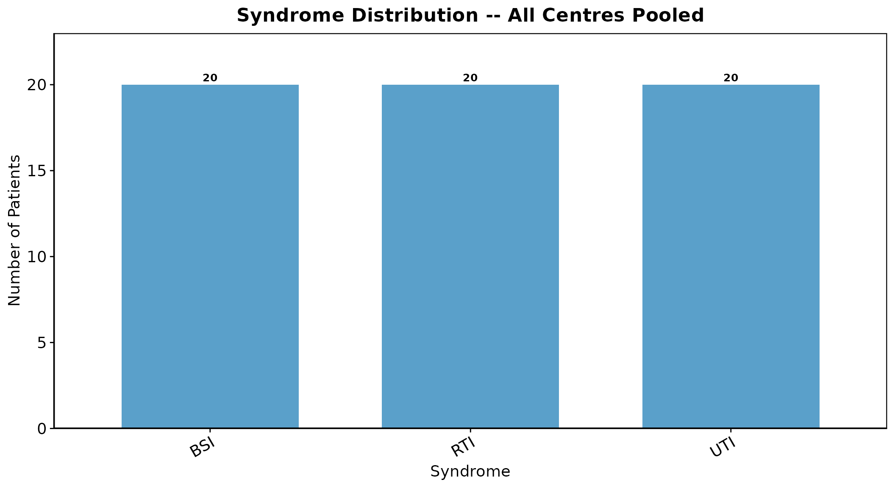

## Length of Stay and Age Distributions

### LOS ridge plot

``` r
plot_los_ridge(
  eda_data, mode = "all", patient_col = "patient_id", center_col = "center_name",
  admission_col = "date_of_admission", discharge_col = "date_of_final_outcome"
)
```

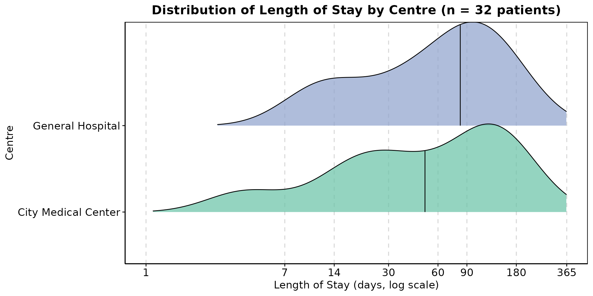

### Age ridge plot

``` r
plot_age_ridge(eda_data, mode = "all", patient_col = "patient_id", age_col = "Age", center_col = "center_name")
```

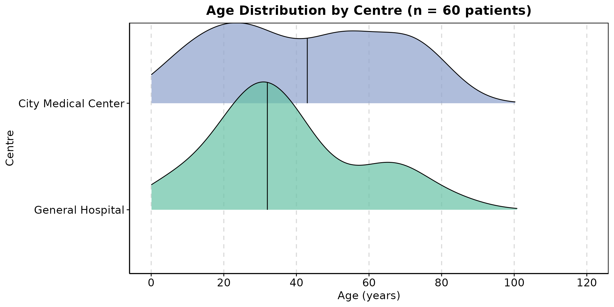

### LOS by age bin

``` r
plot_los_by_agebin(
  eda_data, mode = "overall", patient_col = "patient_id", agebin_col = "Age_bin",
  age_col = "Age", center_col = "center_name",
  admission_col = "date_of_admission", discharge_col = "date_of_final_outcome"
)
```

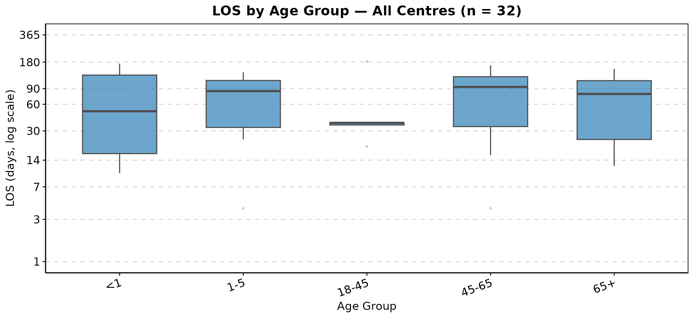

------------------------------------------------------------------------

## Pipeline at a Glance

    Preprocessing output (prep_* pipeline, analysis-ready long-format data)
              │
              ▼
      plot_top_organisms() / plot_abx_susceptibility() / plot_abx_heatmap()
      plot_resistance_by_sample() / plot_resistance_by_agebin() / plot_resistance_by_organism()
              │            (organism & susceptibility overview)
              ▼
      plot_outcome_distribution() / plot_outcome_by_organism() / plot_death_discharged()
      plot_outcome_by_agebin() / plot_outcome_by_year()
              │            (outcome patterns)
              ▼
      plot_patients_by_hospital() / plot_mono_poly_by_facility() / plot_hai_cai_by_facility()
      plot_location_by_facility() / plot_infection_type_by_location() / plot_syndrome_distribution()
              │            (case-mix and facility patterns)
              ▼
      plot_los_ridge() / plot_age_ridge() / plot_los_by_agebin()
              │            (LOS / age distributions)
              ▼
      Reviewed cohort -> proceed to DALY Burden Estimation (Pipeline 3)

## Summary

The EDA layer is meant to be run interactively, plot by plot, while
deciding whether the preprocessed cohort is ready for burden estimation
– not wrapped into a single automated entry point the way
[`run_preprocess()`](https://saketlab.github.io/anumaan/reference/run_preprocess.md)
is for Pipeline 1. A typical review pass:

1.  Check organism and susceptibility patterns for anything unexpected
    ([`plot_top_organisms()`](https://saketlab.github.io/anumaan/reference/plot_top_organisms.md),
    [`plot_abx_heatmap()`](https://saketlab.github.io/anumaan/reference/plot_abx_heatmap.md))
2.  Check outcome distributions and case-mix balance across centres
3.  Check LOS/age distributions for implausible values before they reach
    burden estimation
4.  Only then move on to the [DALY Burden Estimation
    vignette](https://saketlab.github.io/anumaan/articles/daly-pipeline.md)

## Session Info

``` r
sessionInfo()
#> R version 4.6.1 (2026-06-24)
#> Platform: x86_64-pc-linux-gnu
#> Running under: Ubuntu 24.04.4 LTS
#> 
#> Matrix products: default
#> BLAS:   /usr/lib/x86_64-linux-gnu/openblas-pthread/libblas.so.3 
#> LAPACK: /usr/lib/x86_64-linux-gnu/openblas-pthread/libopenblasp-r0.3.26.so;  LAPACK version 3.12.0
#> 
#> locale:
#>  [1] LC_CTYPE=C.UTF-8       LC_NUMERIC=C           LC_TIME=C.UTF-8       
#>  [4] LC_COLLATE=C.UTF-8     LC_MONETARY=C.UTF-8    LC_MESSAGES=C.UTF-8   
#>  [7] LC_PAPER=C.UTF-8       LC_NAME=C              LC_ADDRESS=C          
#> [10] LC_TELEPHONE=C         LC_MEASUREMENT=C.UTF-8 LC_IDENTIFICATION=C   
#> 
#> time zone: UTC
#> tzcode source: system (glibc)
#> 
#> attached base packages:
#> [1] stats     graphics  grDevices utils     datasets  methods   base     
#> 
#> other attached packages:
#> [1] dplyr_1.2.1        anumaan_0.1.0.9028
#> 
#> loaded via a namespace (and not attached):
#>  [1] janeaustenr_1.0.0  tidyr_1.3.2        sass_0.4.10        generics_0.1.4    
#>  [5] rstatix_1.1.0      stringi_1.8.9      lattice_0.22-9     digest_0.6.39     
#>  [9] magrittr_2.0.5     evaluate_1.0.5     grid_4.6.1         RColorBrewer_1.1-3
#> [13] fastmap_1.2.0      jsonlite_2.0.0     Matrix_1.7-5       tidytext_0.4.3    
#> [17] backports_1.5.1    Formula_1.2-6      purrr_1.2.2        scales_1.4.0      
#> [21] textshaping_1.0.5  jquerylib_0.1.4    abind_1.4-8        cli_3.6.6         
#> [25] rlang_1.3.0        tokenizers_0.3.0   withr_3.0.3        cachem_1.1.0      
#> [29] yaml_2.3.12        otel_0.2.0         tools_4.6.1        ggsignif_0.6.4    
#> [33] ggplot2_4.0.3      ggpubr_1.0.0       broom_1.0.13       vctrs_0.7.3       
#> [37] R6_2.6.1           ggridges_0.5.7     lifecycle_1.0.5    car_3.1-5         
#> [41] fs_2.1.0           ragg_1.5.2         pkgconfig_2.0.3    desc_1.4.3        
#> [45] pkgdown_2.2.1      pillar_1.11.1      bslib_0.12.0       gtable_0.3.6      
#> [49] glue_1.8.1         Rcpp_1.1.2         systemfonts_1.3.2  xfun_0.60         
#> [53] tibble_3.3.1       tidyselect_1.2.1   knitr_1.51         farver_2.1.2      
#> [57] htmltools_0.5.9    SnowballC_0.7.1    labeling_0.4.3     carData_3.0-6     
#> [61] rmarkdown_2.31     compiler_4.6.1     S7_0.2.2
```
